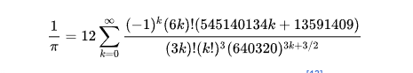

## PiCalculator

Among the sites, 7learn.com site explained 4 algorithms well

* Monte-Carlo method to calculate pi

* A calculation method for the Pi number

* The infinite sum method in calculating Pi

* An improved infinite sum method for calculating Pi

Among these four algorithms, the last algorithm was the most optimal and accurate algorithm

## About this algorithm:
### Chudnovsky algorithm

Ramanujan wrote two formulas to calculate pi. The Chanowski brothers,
Gregory (1952) and Dioud (1947) improved Ramanujan's early formulas.

The Chudnovsky algorithm is a fast method for calculating the digits of π, based on Ramanujan's π formulae. Published by the Chudnovsky brothers in 1988, it was used to calculate π to a billion decimal places.

<<<<<<< HEAD
It was used in the world record calculations of 2.7 trillion digits of π in December 2009, 10 trillion digits in October 2011, 22.4 trillion digits in November 2016, 31.4 trillion digits in September 2018–January 2019, 50 trillion digits on January 29, 2020, 62.8 trillion digits on August 14, 2021, 100 trillion digits on March 21, 2022, and 105 trillion digits on March 14, 2024.

## Semaphoro

By searching the internet, sites linkedin.com and geeksforgeeks.org provided a good definition of semaphore.

* linkedin: In Java's concurrency API, a semaphore is another synchronization tool that simultaneously controls the number of threads accessing a particular resource or section of code. It manages a set of permits; threads must acquire a permit before proceeding. If a permit is available, the thread acquires it and continues execution. If not, the thread is blocked until a permit becomes available or interrupted.

* geeksforgeeks: A semaphore controls access to a shared resource through the use of a counter. If the counter is greater than zero, then access is allowed. If it is zero, then access is denied. What the counter is counting are permits that allow access to the shared resource. Thus, to access the resource, a thread must be granted a permit from the semaphore.
=======
It was used in the world record calculations of 2.7 trillion digits of π in December 2009, 10 trillion digits in October 2011, 22.4 trillion digits in November 2016, 31.4 trillion digits in September 2018–January 2019, 50 trillion digits on January 29, 2020, 62.8 trillion digits on August 14, 2021, 100 trillion digits on March 21, 2022, and 105 trillion digits on March 14, 2024.
>>>>>>> origin/develop
